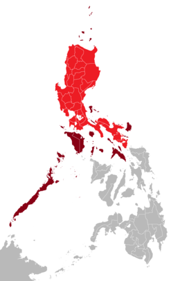

# LGUs PH Web App
Local Government Units in the Philippines Web Application (LGUs PH Web App) by M. K. Salada

This web application manages the data of the Local Government Units (LGUs) in the Philippines but only covers the regions of Luzon island: National Capital Region (NCR), Regions 1 to 5, and Cordillera Administrative Region (CAR). This application is inspired from the Local Government Academy’s Local Government Units Directory ([lga.gov.ph/directory](https://lga.gov.ph/directory)) where you can find all of the LGUs in the whole Philippine islands.

The database was made easy because of _OJ Tibi’s Philippine Provinces and Cities_ database ([bit.ly/2sjMM8Y](https://bit.ly/2sjMM8Y)) and the Wikipedia maps of the LGUs from Local Government Academy website.

## Installation Materials
* Text editor
* Web browser
* Web server
* Database application
* Files in the repository
    * ```lgus.rar```
    * ```luzonlgus.sql```

## Installation Procedures
First, ensure that your web server’s Apache and MySQL are both running. Then, import the ```luzonlgus.sql``` script in your database application inside your choosen database.

Copy the ```lgus``` folder inside your web server’s ```www``` or ```htdocs``` folder. Then, open it. You will see a folder named ```public```. Copy it’s location address.

Inside your web server’s Apache folder, open the ```httpd.conf``` file in your text editor. Find ```DocumentRoot```, paste the ```public``` folder’s location as replacement to its default address. Do it also on ```Directory``` address under it. Just like this:

```
DocumentRoot "${INSTALL_DIR}\www\lgus\public"
<Directory "${INSTALL_DIR}\www\lgus\public">
```

Then, inside the ```lgus``` folder, open the folder named ```app```, and open the ```database.php``` file in your text editor. Find the ```class Database``` and inside it, find ```public $default```. Change the ```hostname```, which is ```localhost``` if you want, and provide a ```username```, ```password``` (you can leave this blank) and ```database```. Now open your web browser and type “localhost”.

# About The Philippines




## Luzon
Luzon is the largest and most populous island in the Philippines. It is ranked 15th largest in the world by land area. Located in the northern portion of the archipelago, it is the economic and political center of the nation, being home to the country's capital city, Manila, as well as Quezon City, the country's most populous city. With a population of 53 million as of 2015, it is the fourth most populous island in the world, containing 52.5% of the country's total population.

Luzon may also refer to one of the three primary island groups in the country. As such, it includes the Luzon mainland, the Batanes and Babuyan groups of islands to the north, Polillo Islands to the east, and the outlying islands of Catanduanes, Marinduque and Mindoro, among others, to the south. The islands of Masbate, Palawan and Romblon are also included as well, though these three are sometimes grouped in the Visayas. *([Wikipedia](https://en.wikipedia.org/wiki/Luzon))*

### Regions of Luzon
* National Capital Region (NCR)
* Region 1: Ilocos Region
* Region 2: Cagayan Valley
* Region 3: Central Luzon
* Region 4-A: CALABARZON
* Region 4-B: MIMAROPA
* Region 5: Bicol Region
* Cordillera Administrative Region (CAR)


# Download
File download options

<!--* [Google Drive](https://drive.google.com/drive/folders/1xSP8bj3qvd1BzclYDcEBKiMJ8lRiv2QN)-->
* [Zip File](https://github.com/mksalada/LGUs-PH-Web-App/archive/master.zip)
* [Fork/Clone Repository on GitHub](https://github.com/mksalada/LGUs-PH-Web-App/)

# About This Project
This project *'Local Government Units in the Philippines Web Application (LGUs PH Web App)'* is for the completion of my subject *'ITP 6/L Web Development'* to Mr. Roy Cyril Dosado (@[rcdosado](https://github.com/rcdosado)) at the Palawan State University.

## Citations
Photos and Icons are not mine.

* The photo of the island of Luzon for this website is from [wikimedia.org](https://upload.wikimedia.org/wikipedia/commons/thumb/f/f8/Luzon_Island_Red.png/260px-Luzon_Island_Red.png).

## License
[](https://creativecommons.org/licenses/by-nc/4.0/)

This work is licensed under the Creative Commons Attribution-NonCommercial 4.0 International License. To view a copy of this license, visit [creativecommons.org/licenses/by-nc/4.0/](https://creativecommons.org/licenses/by-nc/4.0/) or send a letter to Creative Commons, PO Box 1866, Mountain View, CA 94042, USA.

## Notice
This application is on-going. Currently it have data of Luzon area only. Soon we will add Visayas and Mindanao areas next time so that we can cover the whole Philippines.

## Developer/Author
Maria Kristina Salada

View profile on GitHub [Account](https://github.com/mksalada) or [Page](https://mksalada.github.io)

## Contact
For inquiries, visit [www.mksph.ml/#contact](https://mksph.ml/#contact). Please fill up all the textboxes for complete details of your concern.
